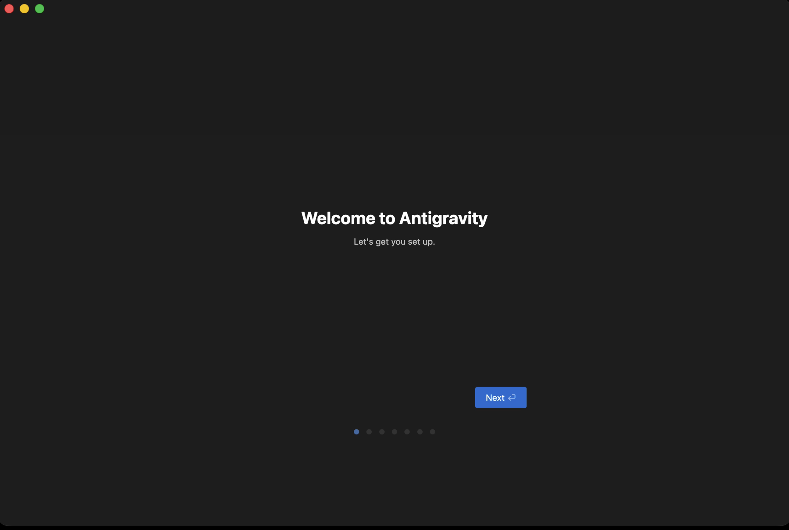
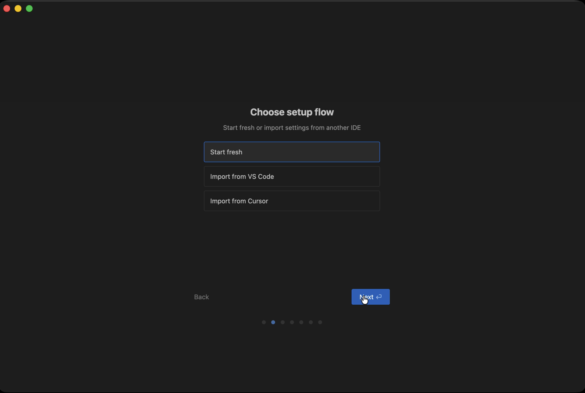
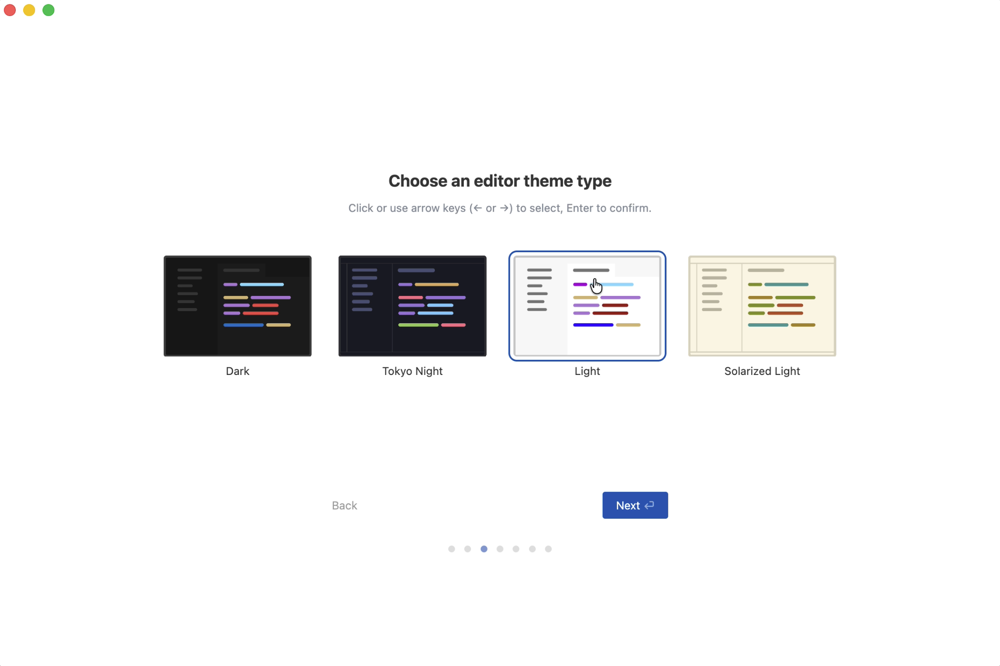
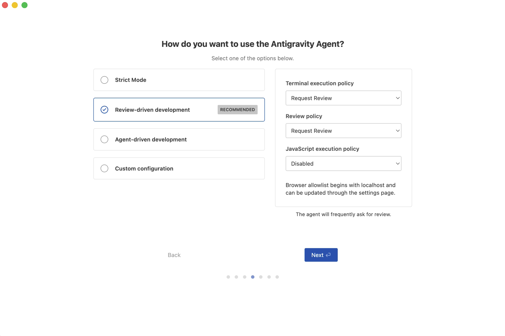
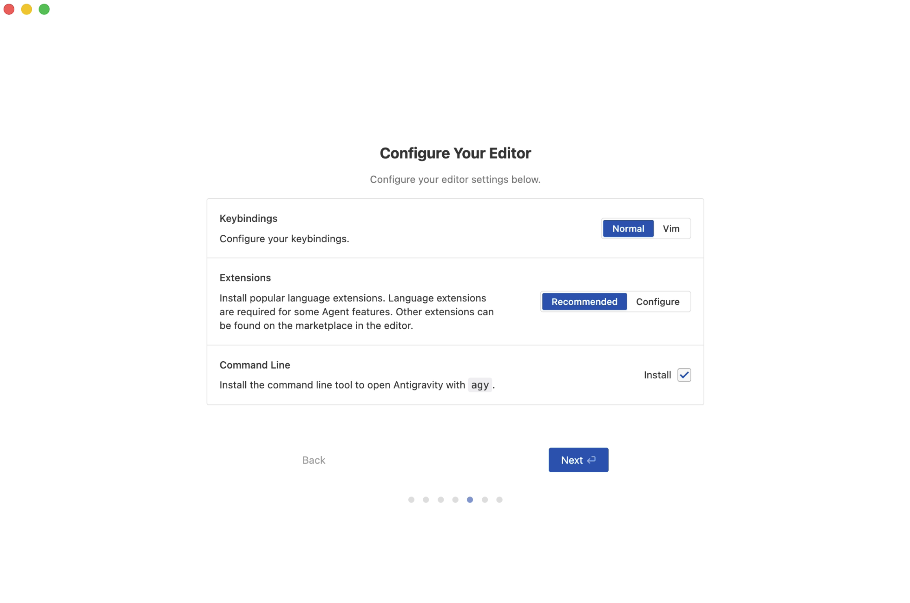
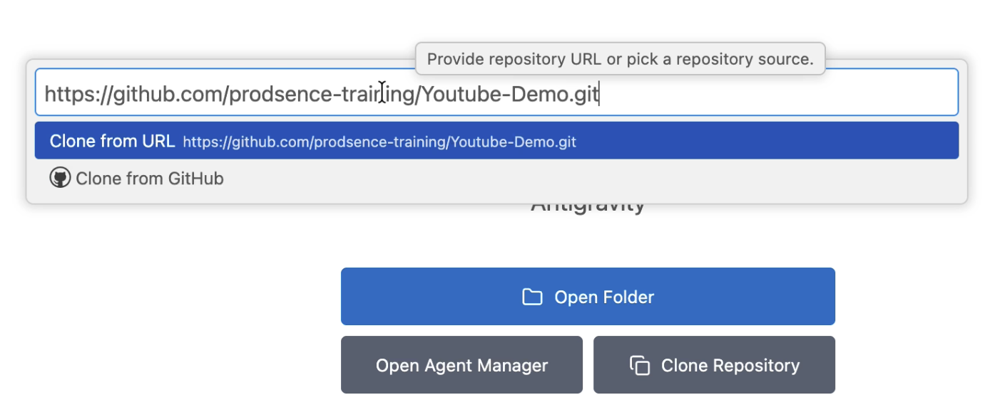
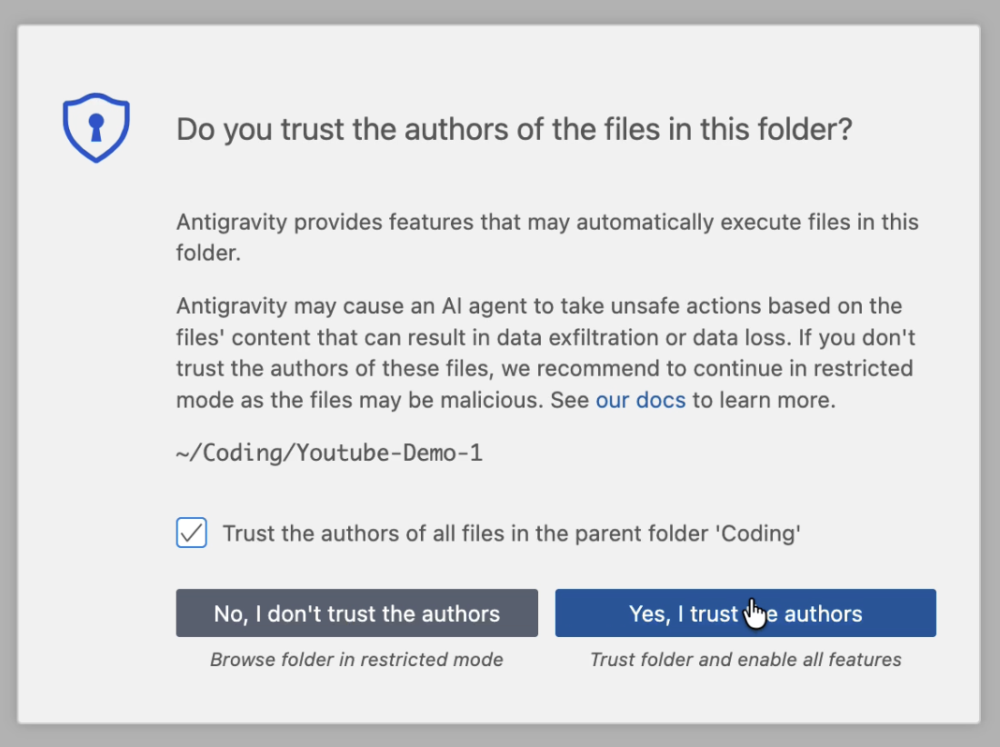
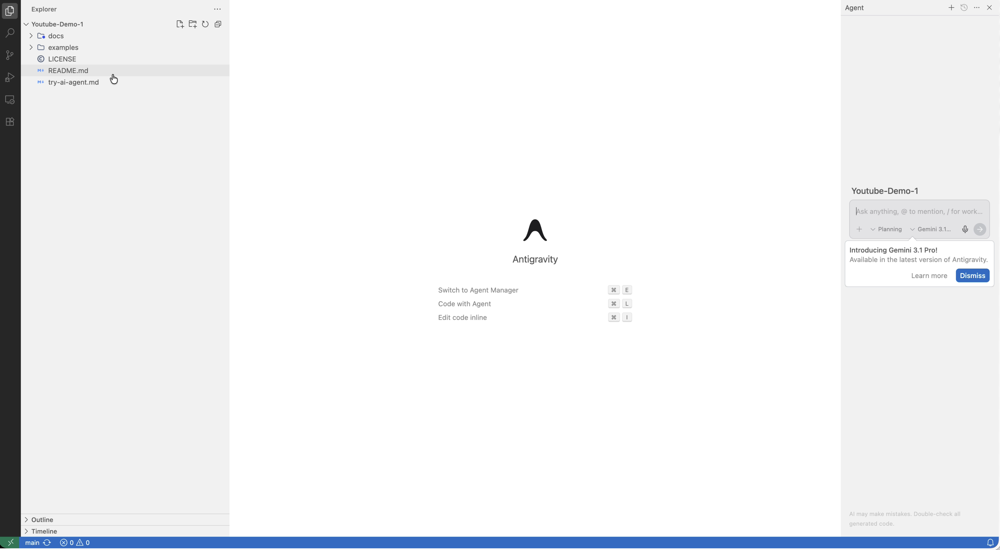

# GitHub Demo 專案

這是一個簡單的示範專案，用來教學如何透過 **Antigravity** 或 **VSCode** 從 GitHub Clone 專案到本地電腦。

## 📁 專案結構

```
Github-Demo/
├── README.md              (這個檔案)
├── docs/
│   └── getting-started.md (快速開始指南)
└── examples/
    └── example.txt        (示範檔案)
```

## 🚀 如何 Clone 本專案

### 方法 1：使用 Antigravity

Antigravity 是 Google 發行的 AI IDE，配備智能 Agent 功能，可以幫助你更高效地進行程式開發。

**前置要求：**
- 已從 Antigravity 官網下載並安裝（https://antigravity.google/）

**步驟：**

1. 打開 Antigravity 應用程式



2. 首次啟動時會進入初始化設定流程

**2.1 選擇偏好的設定流程**



第一個畫面會問你要不要從 VS Code 或 Cursor 匯入設定。
如果你之前沒用過這些工具，直接選「Fresh Start」就好。

**2.2 選擇編輯器主題**



接下來選主題。如果你喜歡深色背景就選 Dark，不喜歡的話可以選 Light。
別擔心，等一下我會教你怎麼換成更多主題選擇。先隨便選一個，我們繼續。

**2.3 配置 Agent 使用模式**



這一步很重要。它在問你希望 AI 有多自動。
我建議初學者選「Review-driven development」，也就是目前顯示 Recommended 的這個。
這個模式下，AI 每做一步都會先問你，你同意了它才會執行。這樣你可以慢慢了解 AI 在幹嘛，比較有安全感。

右邊的 Terminal 跟 Review policy 都保持 Request Review 不用改。
JavaScript execution 保持 Disabled 就好。

**2.4 設定編輯器選項**



這邊是編輯器設定。三個都保持預設就好：
Normal 鍵位、Recommended 擴充套件、Command Line 勾著也沒關係。
直接按 Next。

3. 完成設定後，你會看到 Antigravity 編輯器主畫面

4. 在 Antigravity 內 Clone 此專案：在左側導航欄中，找到「Clone Repository」選項



5. 在搜尋框輸入此專案的 GitHub URL：
   ```
   https://github.com/[username]/Github-Demo.git
   ```

6. 選擇本專案進行 Clone

7. 系統會提示你信任資料夾作者，點擊「信任」確認



8. Clone 完成後，你可以開始編輯程式碼並使用 Agent 功能



**提示：** 你也可以先用其他方式（如 Git 命令列或 VSCode）Clone 此專案，然後在 Antigravity 中打開資料夾即可。

---

### 方法 2：使用 VSCode

如果你已安裝 VSCode，可以直接在本地 Clone 專案。

**前置要求：**
- 已安裝 VSCode (下載：https://code.visualstudio.com/)
- 已安裝 Git (下載：https://git-scm.com/)

**步驟：**

1. 開啟 VSCode

2. 按 `Ctrl + Shift + P` (Windows/Linux) 或 `Cmd + Shift + P` (Mac) 開啟命令面板

3. 輸入 `Git: Clone` 並按 Enter

4. 在跳出的對話框中輸入本專案的 GitHub URL：
   ```
   https://github.com/[username]/Github-Demo.git
   ```

5. 選擇要儲存的本地資料夾位置

6. 點擊「Open」，VSCode 會自動開啟 clone 下來的專案

**截圖說明：**

```
[預期截圖位置 1] - VSCode 首頁面
[預期截圖位置 2] - 命令面板輸入 "Git: Clone"
[預期截圖位置 3] - 輸入 Repository URL 的對話框
[預期截圖位置 4] - 選擇本地資料夾位置
[預期截圖位置 5] - Clone 完成後的 VSCode 專案頁面
```

---

### 方法 3：使用命令列（進階用法）

如果你熟悉命令列，也可以使用 `git clone` 命令：

```bash
git clone https://github.com/[username]/Github-Demo.git
cd Github-Demo
```

---

## 📚 後續步驟

- 查看 `docs/getting-started.md` 了解快速開始指南
- 探索 `examples/` 資料夾查看示範檔案
- 修改文件並嘗試提交變更（Commit）到你的 Fork

---

## ❓ 常見問題

**Q: 我需要先 Fork 嗎？**
A: 不一定。你可以直接 Clone 公開專案。若要提交更改，建議先 Fork 專案到自己的帳號。

**Q: Clone 和 Fork 有什麼差別？**
A:
- **Clone**：將程式碼複製到本地電腦
- **Fork**：在 GitHub 上複製整個專案到自己的帳號

**Q: 我的 Clone 出現錯誤？**
A: 請檢查：
1. 網路連接是否正常
2. Repository URL 是否正確
3. Git 是否已正確安裝

---

## 🤝 貢獻

歡迎對本專案提出建議或改進！

---

**最後更新**：2026-02-21
